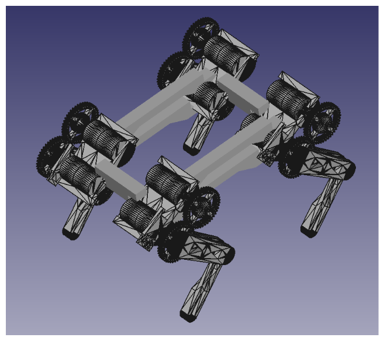

# MECHKAv3
## Андрей Ежков
## ВНИМАНИЕ! Това репо е само с демонстративни цели. Проектът има друга частна репозитория, в който се съхраняват всички файлове по проекта. Благодаря!
MECHKA v3 е третият четирикрак робот от поколението MECHKA. Роботът има експериментален характер, иновации в хоби четирикраките изобретения.

## Отличителни черти
 
1. [4 крака с директна и отдалечена актуация на ставите]
2. [8 електромотора, всеки със собствен квадратурен енкодер]
3. [Безжичен контрол]
4. [Собствена платка]
